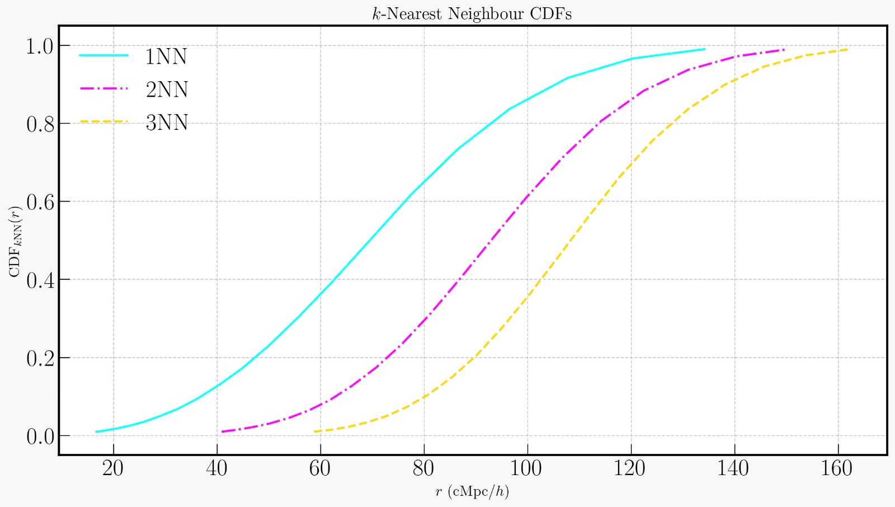
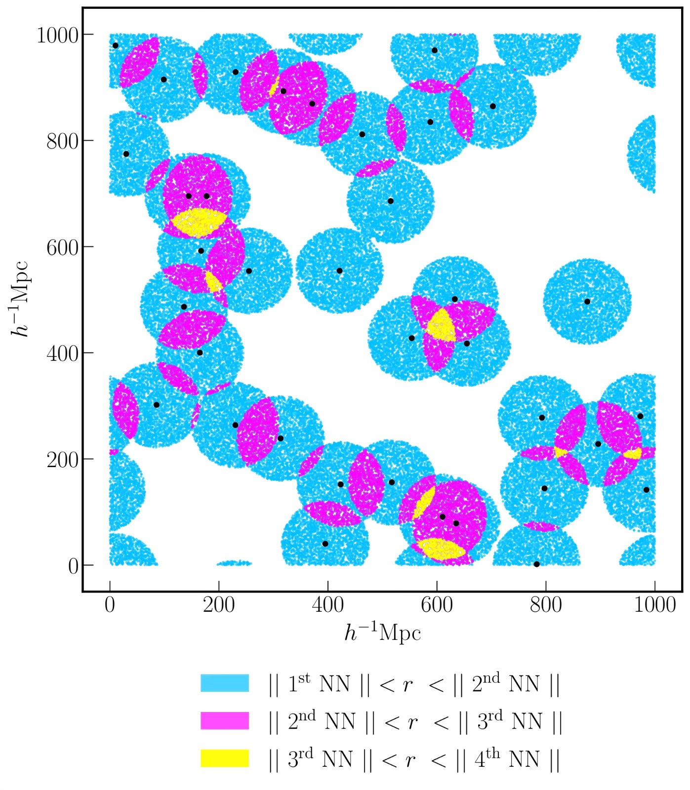

<p align="center">
  
</p>

---

`kNNpy` is a Python package for computing the **$k$-nearest neighbour distributions** — powerful summary statistics designed to capture the full non-Gaussian information content of cosmological clustering. The package provides a modular and efficient framework to analyze both 2D and 3D large-scale structure data, going beyond traditional two-point statistics.

---

## 📦 Features

`kNNpy` provides the following functionalities:

- **Compute *k*NN distributions**:
  - `kNNpy.kNN_3D` — clustering of discrete data points (tracers) and continuous overdensity fields in 3D ($x, y, z$)
    - Tracer auto-clustering
    - Tracer $\times$ tracer cross-clustering
    - Tracer $\times$ field cross-clustering
  - `kNNpy.kNN_2D_Ang` — angular clustering of discrete data points and continuous overdensity fields in the sky ($\alpha, \delta$)
    - Tracer auto-clustering
    - Tracer $\times$ tracer cross-clustering 
    - Tracer $\times$ field cross-clustering
- **Helper Submodules**: 
	- `kNNpy.HelperFunctions`, `kNNpy.HelperFunctions_2DA`
	- Shared utilities such as nearest-neighbour distance calculations and spatial smoothing of continuous fields
  - Designed to support both `kNN_3D` and `kNN_2D_Ang` workflows
- **Auxiliary Modules**:
  - **Statistics of Peaks**:  `kNNpy.Auxiliary.PeakStatistics`
    Analyze the high-density tail of the matter distribution  
  - **Two-point Correlation Function (2PCF)**: `kNNpy.Auxiliary.TPCF`
    Standard pair-counting statistics, implemented for tracer $\times$ field cross-clustering in 3D and angular 2D coordinates
  - **Fisher Matrix Construction**:  
    Forecasts for cosmological parameter constraints  

---

## 📚 Dependencies

`kNNpy` makes use of the following packages:

- `numpy`
- `scipy`
- `pyfftw`
- `pylians`
- `healpy` *(optional)*
- `scikit-learn` *(optional)*
- `astropy-healpix` *(optional)*
- `matplotlib` *(optional)*

These need to be installed before using the package, preferably in a fresh virtual environment (see instructions below).  
> 💡 **Optional dependencies**  
> - `scikit-learn` can be skipped if you do not intend to use the `kNNpy.kNN_2D_Ang` module
> - `astropy-healpix` can be skipped if you do not intend to use the `Auxiliary.TPCF.TracerField2D` module. 
> - `healpy` and `matplotlib` can be skipped if you do not intend to use the `kNNpy.kNN_2D_Ang`, `kNNpy.Auxiliary.TPCF.TracerField2D` and `kNNpy.Auxiliary.PeakStatistics` modules.

---

## 🛠 Installation

### 🐧 Linux/macOS

Change to your preferred installation directory, create a Python virtual environment and install the dependencies.

**⚠️ Warning**: Do **not** use `anaconda` or `miniconda` for the virtual environment as it may cause conflicts with `Pylians`. Also, do **not** name the virtual environment `kNNpy` to avoid namespace issues.

```bash
cd /path/to/installation/directory
python3 -m venv kNNpy_env
source kNNpy_env/bin/activate
pip install numpy scipy pyfftw Pylians healpy scikit-learn astropy-healpix matplotlib
```

> 💡 **Note on Pylians installation**  
> Sometimes, the Pylians installation fails when using `pip` (especially on macOS). If that happens:
>
> - First install all other dependencies (without Pylians)
> - Then install Pylians in development mode following their official instructions:  
> 👉 [Pylians_documentation](https://pylians3.readthedocs.io/en/master/installation.html#)

If you **do not** want the optional dependencies, replace the last line above by:

```bash
pip install numpy scipy pyfftw Pylians
```

### 📥 Clone this repository

```bash
git clone https://github.com/vikhyat108/kNNpy.git
```

### 🧭 Set your `PYTHONPATH`

Export the path to the installed repository to your Python path:

- **Temporarily** (for current shell session):

```bash
export PYTHONPATH="${PYTHONPATH}:/path/to/installation/directory/kNNpy/"
```

- **Permanently** (recommended): add the line above to your `~/.bashrc` or `~/.zshrc`.

### ✅ Test the installation

To check if `kNNpy` is successfully installed and ready to use, run the following command:

```bash
cd /path/to/installation/directory/
cd kNNpy/Tests/
python3 import_all_modules.py
```

If you did not install the optional dependencies, replace the last line above by:

```bash
python3 import_required_modules.py
```
If no error message is returned, the installation is succesful.

---

### 🪟 Windows

Unfortunately, `kNNpy` is currently not supported on Windows. Future support may be added in later releases.

---

## ▶️ Usage

Change to your working directory:

```bash
cd /my/working/directory
```

Activate your virtual environment:

```bash
source /path/to/virtual/environment/bin/activate
```

Set the `PYTHONPATH` (if not already done) and in your Python scripts or notebooks, you can now:

```python
import kNNpy
```

💡 **Note**: If you skipped the optional dependencies, use the `from kNNpy import <MODULE NAME>` idiom instead of `import kNNpy`.


---

## 🔬 Scientific Background

Mapping and characterizing the large-scale structure of the universe is a key scientific enterprise in modern Cosmology. The spatial clustering of celestial object such as galaxies, binary black holes and clouds of neutral hydrogen that trace structure formation contains a wealth of information about cosmology and tracer astrophysics.

Traditionally, clustering is measured using two-point summary statistics that provide a complete description for tracers of Gaussian random fields. However, on small spatial scales accessible with modern cosmological surveys such as DESI, LSST and Euclid, where the effect of gravitational non-linearities cannot be neglected, the cosmological matter field can no longer be approximated as a Gaussian random field. Therefore, we need to move beyond two-point statistics to fully utilize the information contained in the data.

For a given set of discrete data points (for example, galaxies from an astronomical survey), the $k$-nearest neigbour (*k*NN) distributions are defined as the empirical cumulative distribution functions of distances from volume-filling random points to their $k^{\rm th}$ nearest data point. These distributions are robust summary statistics for quantifying spatial clustering in discrete data.

 The *k*NN distributions are formally sensitive to **all connected $N$-point functions** and can extract information from **non-Gaussian features** present in the data on small scales, making them powerful alternatives to traditional summary statistics like the correlation function or power spectrum. They are easy to compute from data and computationally more efficient than individual higher-order clustering statistics such as the bispectrum and the trispectrum. They have been shown to significantly boost the detection of spatial clustering in observed and simulated data over two-point statistics; improve cosmological constraints for fisher forecasts; and are more robust in the presence of large statistical scatter in data.

*k*NN distributions and the methods implemented in `kNNpy` were first introduced for discrete data in:

> **Banerjee & Abel (2021)**  
> *Nearest neighbour distributions: New statistical measures for cosmological clustering*  
> 📄 [doi.org/10.1093/mnras/staa3604](https://doi.org/10.1093/mnras/staa3604)

and were later generalised to [cross-correlations](https://doi.org/10.1093/mnras/stab961) and [continuous fields](https://doi.org/10.1093/mnras/stac3813).

---

## 📘 Documentation

The latest documentation for `kNNpy`, generated using [pdoc](https://pdoc.dev/), can be found [**here**](https://kitnenikatnivasi.github.io/kNNpy_documentation_html/kNNpy.html).

---

## 📬 Contact

For comments, questions or bug reports, feel free to reach out:  
📧 **kitnenikatnivasi@gmail.com**

---

## 🌐 Website

🌍 You can find more about the code, the science, and the team [**here**](https://kitnenikatnivasi.github.io).

---

## 🖼️ Some Cool Visualisations

<p align="center">
  
  <br>
  <em>Figure 1: Comparison of CDFs for <code>k = 1, 2, 3</code> nearest neighbours.</em>
</p>

<p align="center">
  
  <br>
  <em>Figure 2: Colored regions showing overlap of 1st, 2nd, and 3rd nearest neighbour spheres.</em>
</p>
